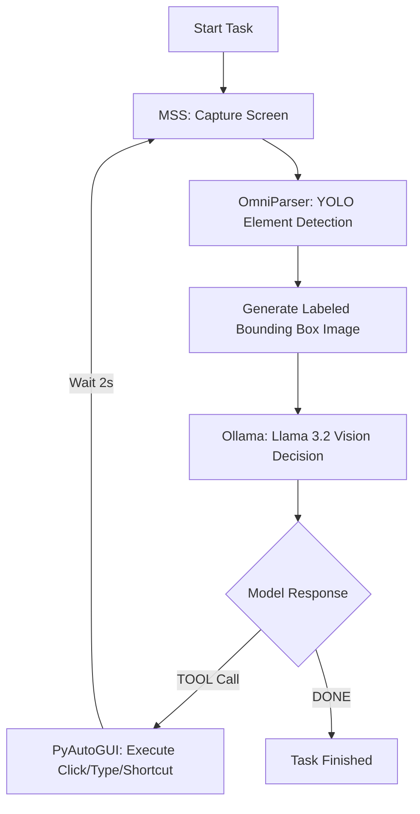

# mcp-vision

A local, autonomous AI agent that watches your screen, understands the visual layout, and executes native OS commands (clicking, typing) on your behalf. **No cloud APIs, no subscriptions, and zero data leaving your machine.**

This agent is built as a custom local orchestration pipeline, bridging vision models directly with standard OS automation. 

---

## 🛠️ The Technology Stack

I built this project by integrating the following state-of-the-art local technologies:

*   **Microsoft OmniParser V2 (YOLOv8)**: The visual parser. It runs locally to detect and draw numbered bounding boxes (Set-of-Mark) over all interactive UI elements on the screen.
*   **Ollama & Llama 3.2 Vision (11b)**: The reasoning engine. By running Llama 3.2 Vision locally, the agent understands both the user task and the visual state of the screen to decide the next action.
*   **PyAutoGUI**: The mechanical hands. It translates the coordinates and keys selected by the model into physical clicks, keypresses, and keyboard shortcuts.
*   **MSS**: A lightweight, multi-platform screenshot tool used to capture high-performance screen frames.
*   **Model Context Protocol (MCP)**: A standard interface that structures the tools (click, type, press keys) so they can be easily registered, called, and scale to other AI platforms.

---

## 🧠 How It Works (The Pipeline)



1.  **Capture**: The agent takes a raw screen capture of your workspace.
2.  **Parse**: The screenshot is fed into **OmniParser** (YOLOv8) to draw numbered overlays on every click-target, saving both the annotated image and coordinates.
3.  **Reason**: The annotated image, along with your request, is sent to **Llama 3.2 Vision**. The model decides which element to interact with or what keys to press.
4.  **Execute**: The command is dispatched to the tool execution block to click, type text, or run keyboard shortcuts.

---

## ⚡ Technical Optimizations Implemented

To make this agent fast and usable on consumer hardware (like Apple Silicon M-series chips), I implemented several key optimizations:

### 1. YOLO-Only Fast Vision Pass (234s ➡️ ~1s)
Originally, Microsoft's OmniParser pipeline used a heavy secondary model (Florence-2) to generate text captions for every button, icon, and input crop on the screen. Running 100+ caption passes on CPU took **over 4 minutes per cycle**. 
Since Llama 3.2 Vision is a vision-language model, it can see the screen directly. I bypassed the Florence-2 captioning pass entirely. The vision model relies purely on the numbered YOLO overlays. This cut cycle times from **234 seconds to under 1 second**.

### 2. Sequential VRAM Reclaiming
To prevent out-of-memory crashes on systems with unified memory, the pipeline is engineered to load and release models sequentially. The vision-parsing model is run and immediately garbage collected before the vision LLM is invoked.

### 3. Keyboard input combo normalization
Small vision models often output key combinations in arbitrary formats (e.g., `Command + Space` or `command+space`). The execution layer automatically cleans and normalizes this input (mapping to lowercase and standard PyAutoGUI keys like `cmd+space`), preventing formatting-related failures.

---

## 🚀 How to Run

### Setup Environment
```bash
# Set up a conda or virtual environment
source .venv/bin/activate
pip install -r requirements.txt
```

### Running the Agent
Specify your task as a CLI argument. The agent will run in a loop until it reaches completion.

```bash
# Run a general OS task
python phase3_orchestrator/agent.py "Open Spotlight, type 'Notes', open it and type 'Hello World'" --workflow general
```