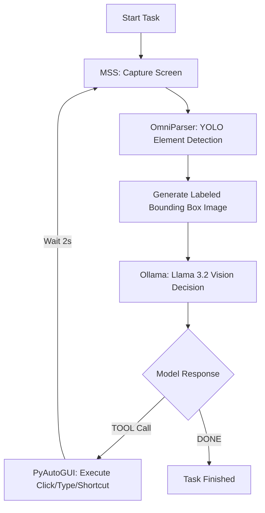
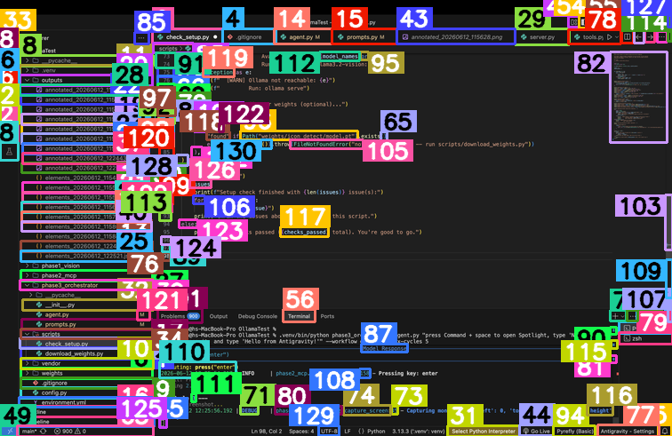

# mcp-vision

A local, autonomous AI agent that watches your screen, understands the visual layout, and executes native OS commands (clicking, typing) on your behalf. **No cloud APIs, no subscriptions, and zero data leaving your machine.**

The architecture is built on a simple premise: bridge local vision models with standard OS automation. The pipeline captures a screenshot, processes it through Microsoft's OmniParser to generate a structured map of interactive elements, and feeds that layout to Llama 3.2 Vision via Ollama. The model then decides the next action, executing it through a clean, composable Model Context Protocol (MCP) server.

---

## The Execution Process

During the initial execution cycle, the agent captures the current state of your display and runs it through the vision parser. It saves an annotated reference screenshot locally, mapping every detected UI element and interactive bounding box to a specific ID coordinate before passing it to the LLM. 

*Example: The agent's internal visual map before executing an OS command.*

---

## Current State & Roadmap

Currently, `mcp-vision` is highly capable of executing simple, repetitive daily OS tasks and navigating static UI layouts autonomously. However, as a v1 release, there is ongoing optimization needed. Future improvements will focus on handling complex, multi-step workflows, managing heavy dynamic scrolling, and reducing inference latency for faster execution cycles.