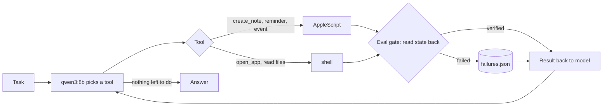
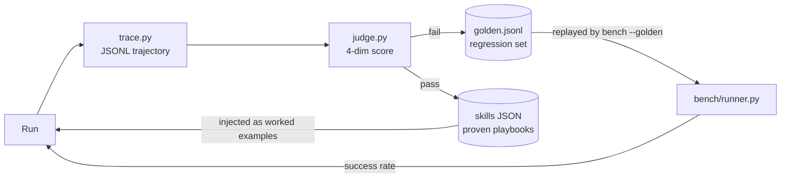

# mac-agent


A local Mac assistant. You type a task, a model figures out which tools to
call, and the tools do the work through macOS itself. **Local by default —
no cloud APIs, no subscriptions, zero data leaving your Mac** — and the model
is swappable if you want a bigger brain: point the same agent at Claude, GPT,
Gemini, or NVIDIA NIM with one flag when a task calls for it.

You point it at a domain by choosing a **specialist** — a system prompt plus a
small tool allowlist — so the same runtime can be a web researcher, a Google
Ads analyst, or an Instagram analyzer. It **acts** where a reliable tool exists
(Notes, Calendar, shell, the browser DOM) and **guides** you (looks at the
screen, tells you the next click) where none does.

And every run is **fully observable and self-improving**: each run writes a
trajectory you can render as an HTML waterfall, a judge scores it, failures
become a regression dataset, and successes become reusable skills the agent
retrieves on the next similar task.

```bash
python agent.py --as general "make a note called Ideas with a haiku about the sea"
python agent.py --as web-researcher "summarize the top story on news.ycombinator.com"
python agent.py --as general --model claude "..."   # swap in a cloud model for one run
python agent.py                    # list specialists

python mac_agent.py "add a reminder to buy coffee and open Calendar"   # the minimal core, standalone
```


```mermaid
graph LR
    A[Task] --> B[qwen3:8b picks a tool]
    B --> C{Tool}
    C -->|create_note, reminder, event| D[AppleScript]
    C -->|open_app, read files| E[shell]
    D --> V{Eval gate: read state back}
    E --> V
    V -->|verified| F[Result back to model]
    V -->|failed| L[(failures.json)]
    L --> F
    F --> B
    B -->|nothing left to do| G[Answer]
```

The model never touches the mouse. It only decides *what* to do; the OS handles
*where*. That one choice is why an 8B model running locally is reliable here —
see the note at the bottom.

## What's in here

- **`agent.py`** — the orchestrator. Loads a specialist, runs one
  **Plan → Act → Reflect** loop, and only ever shows the worker its own 2–6
  tools. This is what you run.
- **`mac_agent.py`** — the minimal tool-calling core over AppleScript + shell.
  Reliable, fast (~8s a step warm), still runs standalone. `agent.py` reuses its
  tools and eval gates.
- **`trace.py` / `trace_viewer.py`** — the observability layer. Every run
  writes a JSONL trajectory (every LLM call, tool call, gate, approval, with
  timings); the viewer renders it as a self-contained HTML waterfall.
- **`judge.py`** — scores every finished run (goal / efficiency / discipline /
  safety) from the trajectory alone; optional LLM second opinion. Failing runs
  are appended to a golden regression set.
- **`skills.py`** — passing runs are distilled into skills (task + the exact
  tool sequence that worked) and injected into future prompts for similar
  tasks.
- **`bench/`** — the eval harness. Task suites run the *real* loop with a
  scripted model + stubbed tools (deterministic, CI-safe) or `--live` on your
  Mac for a true end-to-end success rate.
- **`simple_agent.py`** — the pure-vision foil. Screenshot in, guessed pixel
  coordinates out, the way a cloud computer-use loop works. Slow and it misses a
  lot — kept to show *why* the tool-calling approach exists. Its screenshot loop
  also powers the `guide_user` tool.
- `state_agent.py` — an earlier JSON micro-agent loop, superseded by `agent.py`.

## Specialists

A specialist lives in [`specialists.toml`](specialists.toml) — nothing but a
prompt and a tool allowlist:

```toml
[web-researcher]
plan = true
tools = ["web_navigate", "web_read", "web_click_text", "web_scroll", "guide_user"]
prompt = """You research topics using the attached Chrome browser..."""
```

Add a top-level `[name]` and it's instantly `python agent.py --as name "..."`.
No code. The tool allowlist is the guardrail: a worker that can't see a tool
can't misuse it, which is most of what keeps a small model on the rails.

Ships with `general`, `web-researcher`, `google-ads`, `insta-analyzer`.

### How the loop works

- **Plan** (specialists with `plan = true`): one call turns the goal into a
  short numbered list — guidance, not a rigid graph. An 8B model can't build a
  reliable DAG, so we don't ask it to.
- **Act**: the worker calls one tool at a time, seeing only its allowlist.
- **Reflect**: eval gates confirm each action actually landed; failures persist
  and feed back; and when the worker says "done" it gets one goal-check before
  the loop really ends.
- **Human-in-the-loop**: irreversible/outbound actions (submitting or clicking
  through the browser) print the exact call and wait for a `y/n` in the
  terminal before running.
- **Memory**: `memory/<specialist>.json` keeps that specialist's past failures,
  successes, and prefs, folded into its next prompt. Plain JSON — it learns
  across runs without a database and without leaving your Mac.

## Model backends: bring your own model

Local (Ollama, qwen3:8b) is the default and needs nothing else — that's the
whole "zero data leaves your Mac" pitch. But the model is one injectable
callable (`backends.py`), not baked into the loop, so swapping it is a flag,
not a rewrite:

```bash
python agent.py --as general "..."                    # local, default
python agent.py --as general --model claude "..."      # Anthropic
python agent.py --as general --model gpt "..."         # OpenAI
python agent.py --as general --model gemini "..."      # Google, OpenAI-compatible endpoint
python agent.py --as general --model nvidia "..."       # NIM, OpenAI-compatible endpoint
```

Drop the matching key in `.env` (copy `.env.example`) — `ANTHROPIC_API_KEY`,
`OPENAI_API_KEY`, `GEMINI_API_KEY`, or `NVIDIA_API_KEY`. Nothing else changes:
same tools, same eval gates, same tracing and judging. Every `llm_call` span
in the trace records which backend/model handled it, so a trajectory makes it
obvious exactly which calls stayed local and which left the machine.

Each provider disagrees on wire format — Anthropic has no "tool" role and
wants system prompt as a top-level field; OpenAI-style APIs want tool
arguments JSON-encoded as a string, not a dict — so `backends.py` normalizes
all of them to one shape (`chat(messages, tools) -> message`) and transcodes
both directions. A bad/missing key or a network blip raises `BackendError`,
which `agent.run()` catches at the top level: the trace still closes out, the
judge still scores it, cleanly, instead of crashing the process.

## Quick start

```bash
python3 -m venv .venv
source .venv/bin/activate
pip install -e .
ollama pull qwen3:8b
python scripts/check_setup.py
```

First run of a tool asks for **Automation** permission (System Settings →
Privacy & Security → Automation) — that's macOS gating AppleScript. Allow it
once per app. `simple_agent.py` and the `guide_user` tool additionally need
Screen Recording.

**For the browser specialists**, start Chrome with remote debugging so the web
tools can attach to your real, logged-in session — they never launch their own
browser:

```bash
"/Applications/Google Chrome.app/Contents/MacOS/Google Chrome" --remote-debugging-port=9222
```

If Chrome isn't running this way, the web tools return an error and the
specialist falls back to `guide_user`.

## Tools

| Tool | Does | How |
|---|---|---|
| `create_note` | new Apple Note | AppleScript |
| `add_reminder` | new reminder, optional due date | AppleScript |
| `create_event` | new Calendar event | AppleScript |
| `open_app` | launch/focus an app | `open -a` |
| `list_dir` / `read_file` | look around the filesystem | shell |
| `web_navigate` / `web_read` | open a URL, read the page text | Playwright (CDP) |
| `web_click_text` / `web_click_role` | click by visible text or ARIA role — **gated** | Playwright (CDP) |
| `web_type` / `web_press` / `web_scroll` | type, press a key, scroll the page | Playwright (CDP) |
| `guide_user` | when no tool fits, describe the next click from a screenshot | qwen2.5vl |

Tools live in [`tools.py`](tools.py) — a function plus a schema entry, with
optional `verify` (eval gate) and `dangerous` (needs approval) flags. No
framework. **gated** tools pause for your `y/n` before running.

`web_read` waits and retries once if the first read looks like only nav
chrome — a fresh SPA (React/Vue sites) often serves "Skip to content /
Menu / Try Gemini" before the body hydrates, and the difference between
"page genuinely has nothing" and "page hasn't finished loading" matters: the
old behavior handed the model garbage and it would give up into `guide_user`
even though the article was one beat away from being readable.

## Closed-loop reliability

A tool call that *returns* is not a tool call that *worked*. Notes will happily
make a blank note; Calendar will accept an event on a calendar that doesn't
exist. So the agent doesn't trust return strings — it runs a **closed loop**:
act, then read the world back and confirm.

- **Eval gates.** Each state-changing tool has a `verify()` that queries the OS
  for ground truth — does a note with that title actually exist now? A gate
  that fails is rewritten into an `error:` and handed back to the model, which
  has to react instead of declaring victory. Verification lives in the system,
  not in the model's self-assessment, for the same reason the coordinates do.
- **Failure-pattern memory.** Every error and every failed gate is persisted to
  `failures.json` as a typed `(tool, args, error)` signature. On the next run,
  the recent signatures are folded back into the system prompt as negative
  examples — so a mistake made once ("calendar 'Home' doesn't exist") becomes a
  constraint the agent carries forward. The loop gets more reliable the more it
  runs, without retraining and without leaving your Mac.

Same principle as everything else here: keep the small model out of the parts
it's weak at. It doesn't have to *judge* whether it succeeded, and it doesn't
have to *remember* what went wrong — the system does both and feeds it back.

## The flywheel: every run makes the next one better


```mermaid
graph LR
    R[Run] --> T[trace.py<br/>JSONL trajectory]
    T --> J[judge.py<br/>4-dim score]
    J -->|fail| G[(golden.jsonl<br/>regression set)]
    J -->|pass| S[(skills JSON<br/>proven playbooks)]
    S -->|injected as worked examples| R
    G -->|replayed by bench --golden| B[bench/runner.py]
    B -->|success rate| R
```

- **Trace.** Every run — CLI, bench, anything — appends events to
  `traces/run_<id>.jsonl`: each LLM call, tool call, eval gate, reflection and
  approval, with arguments, results and millisecond timings. The trace *is*
  the export format: it's greppable, diffable, and usable as fine-tuning data.

  ```bash
  python trace_viewer.py traces/run_20260731_things.jsonl   # -> HTML waterfall
  ```

  The viewer output is one dependency-free HTML file
  ([example](docs/example_trace.html)) — a timeline of the run with expandable
  payloads and errors outlined in red.

- **Judge.** After every run, `judge.py` scores the trajectory on **goal,
  efficiency, discipline, safety** — from recorded ground truth (how the run
  ended, errors, repeats, declined approvals), not model vibes. An optional
  LLM-as-judge pass catches what heuristics can't: invented arguments, intent
  drift, ungrounded answers. Runs that fail land in
  `bench/golden/golden.jsonl` — a growing set of real failures.

- **Skills.** Runs that pass are distilled into a skill: the task, the plan,
  and the exact tool sequence that worked. On the next similar task (token
  overlap retrieval — deliberately not embeddings at this scale) the skill is
  injected as a worked example, so the model starts from a proven path.
  Failure memory teaches it what *not* to do; skills teach it what *to* do.

## Bench: measure it, don't vibe it

```bash
python bench/runner.py            # dry: scripted model + stubbed tools, CI-safe
python bench/runner.py --live     # real model + real tools, on your Mac
python bench/runner.py --golden   # replay recorded failures: are they fixed?
```

Suites are TOML ([bench/suites/core.toml](bench/suites/core.toml)): a prompt,
a scripted model, stubbed tool results, and declarative checks against the
trajectory (`tool_called`, `answer_contains`, `judge_pass`,
`reflect_rejected`, `approval_requested`, `max_tool_calls`, ...).

The dry mode runs the **real loop** — allowlists, eval gates, reflection,
approval routing, tracing, judging — with only the model and the OS stubbed
out. That's what CI runs on every push (no Mac, no Ollama needed). `--live`
is the number you quote: end-to-end success rate on your machine. Every bench
run writes trajectories plus `report.json` under `bench/results/`.

The model backend is one injectable callable
(`run(..., chat=fn)` where `fn(messages, tools=None) -> message`), which is
how the bench scripts the model — and how you'd swap in a cloud model in five
lines if you ever wanted to.

## The 7B dilemma (what went wrong, and why it ended up like this)

The first plan was the obvious one: screenshot the screen, let the model see it,
have it point the mouse and click — a fully general "AI uses my computer" agent.
It technically ran. It was also slow (~55 seconds a step) and got things wrong
constantly: it would invent a button that wasn't there, misjudge a coordinate by
a hundred pixels, or read the text on screen and start typing it back like an
instruction.

The reason isn't a bug, it's the model size. A 7–8B model that fits on a laptop
is genuinely weak at the two hardest parts of freestyling a UI: planning a
multi-step task, and pointing at an exact pixel from an image. Cloud agents get
away with it because there's a far bigger model behind them.

So the fix was to stop asking the model to do the parts it's bad at. With
AppleScript, the coordinates come from the OS, not from a guess — the model just
picks `create_note` and fills in the title. Same model, night-and-day
reliability, because the hard part moved out of the model and into the system.

The tradeoff is honest: this only works where a clean interface exists —
scriptable Mac apps, the shell, filtered browser DOM. Point it at a random
bloated website and it hits the same wall the vision version did. That wall is
the size of the model, and locally it doesn't move. So the reliable core is
native macOS, and the messy web is where you'd reach for a cloud model instead.
