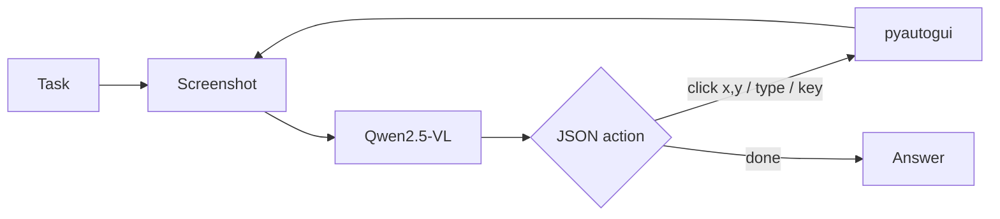

# mcp-vision

A local screen agent. Give it a task, it looks at your screen, moves the mouse, and gives you back an answer. **No cloud APIs, no subscriptions, zero data leaving your machine.**

One model, one loop, ~130 lines:


```mermaid
graph LR
    A[Task] --> B[Screenshot]
    B --> C[Qwen2.5-VL]
    C --> D{JSON action}
    D -->|click x,y / type / key| E[pyautogui]
    E --> B
    D -->|done| F[Answer]
```

The model returns pixel coordinates directly, the same way Claude's computer-use loop works. There is no element detection, no accessibility tree, no bounding-box overlay — the screenshot goes in, `{"action": "click", "x": 412, "y": 88}` comes out, and Ollama's structured-output mode guarantees it parses.

## Quick start

```bash
python3 -m venv .venv
source .venv/bin/activate
pip install -e .
ollama pull qwen2.5vl:7b
python scripts/check_setup.py
```

Grant your terminal **Accessibility** and **Screen Recording** in System Settings → Privacy & Security. Without Screen Recording the screenshot comes back black; `check_setup.py` catches that.

## Usage

```bash
python simple_agent.py "open Safari and search for the weather in Dubai"
```

Every step prints the action and the model's reason. The final line is the result. `--steps N` raises the 15-action ceiling.

## Configuration

Everything lives in `config.py`, overridable with `SCREEN_AGENT_*` env vars or a `.env` file. The one knob that matters:

| Setting | Default | Effect |
|---|---|---|
| `inference_width` | 1280 | Screenshot is downscaled to this before inference. Lower is faster, but grounding gets sloppier on dense UIs. This is the accuracy/speed trade. |
| `model` | `qwen2.5vl:7b` | Must be a *grounding* VLM — one trained to emit pixel coordinates. `qwen2.5vl:3b` is faster and misses more. Most VLMs (moondream, llava) cannot do this at all. |
| `max_steps` | 15 | Give up after this many actions. |

## MCP server

`phase2_mcp/` exposes the same primitives over the Model Context Protocol, so another agent can drive the machine:

```bash
python phase2_mcp/server.py
```

It includes Playwright-backed browser tools that skip the screen entirely — faster and exact, when Chrome is launched with `--remote-debugging-port=9222`. Independent of the agent loop above.

## Limitations

Grounding accuracy is the whole game, and it degrades on dense interfaces — small toolbar icons and tight menus are where clicks miss. The agent doesn't verify its actions: if a click lands in empty space it will happily continue as though it worked. Comparing screenshots before and after each action is the obvious next upgrade.

Expect 2–4s per step on Apple Silicon, essentially all of it model inference.
