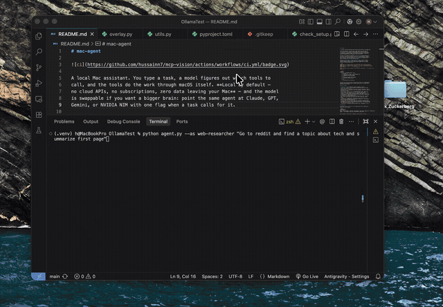
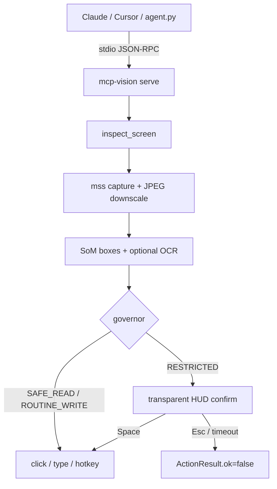
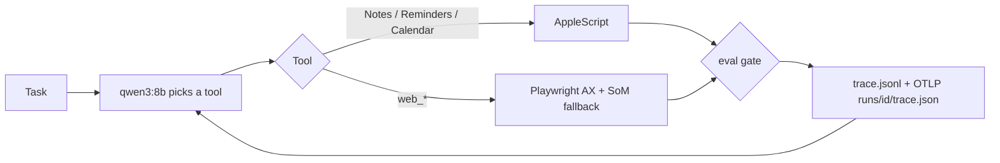

# mcp-vision

[](https://github.com/hussainn7/mcp-vision/actions/workflows/ci.yml)
[](https://www.python.org)
[](https://modelcontextprotocol.io)
[](https://github.com/hussainn7/mcp-vision)

Local-first **screen perception + actuation** over the [Model Context Protocol](https://modelcontextprotocol.io). A host (Claude Desktop, Cursor, or `agent.py`) calls tools; the server looks at the display, numbers the controls, and clicks only after a safety governor (and, for restricted actions, a transparent HUD confirm).

<p align="center">
  
</p>

**[Quick Guide](QUICK_GUIDE.md)** · **[Agent Instructions](AGENT_INSTRUCTIONS.md)**

## Quickstart

```bash
# uv
uv pip install -e .

# pipx (stdio MCP server on PATH)
pipx install .

mcp-vision doctor          # display / accessibility / backends
mcp-vision install         # write Claude Desktop + Cursor MCP config
mcp-vision serve           # stdio JSON-RPC (logs on stderr only)
```

Host config (also written by `mcp-vision install`):

```json
{
  "mcpServers": {
    "mcp-vision": {
      "command": "mcp-vision",
      "args": ["serve"]
    }
  }
}
```

Paths: `~/Library/Application Support/Claude/claude_desktop_config.json` and `~/.cursor/mcp.json`.

HUD overlay (optional): `pip install -e ".[hud]"` then restricted clicks draw a red box — **Space** confirm / **Esc** abort / timeout auto-pauses.

## Architecture


```mermaid
flowchart TB
    Host["Claude / Cursor / agent.py"] -->|stdio JSON-RPC| Server["mcp-vision serve"]
    Server --> Inspect["inspect_screen"]
    Inspect --> Capture["mss capture + JPEG downscale"]
    Capture --> Parser["SoM boxes + optional OCR"]
    Parser --> Governor{"governor"}
    Governor -->|SAFE_READ / ROUTINE_WRITE| Actuate["click / type / hotkey"]
    Governor -->|RESTRICTED| HUD["transparent HUD confirm"]
    HUD -->|Space| Actuate
    HUD -->|Esc / timeout| Abort["ActionResult.ok=false"]
```

| Tool | Returns |
|---|---|
| `inspect_screen(display_id=0)` | `ScreenInspectionResult` — numbered elements, no PNG on the wire |
| `click_element(id, click_type="single")` | `ActionResult` |
| `type_text(id, text, press_enter=false)` | `ActionResult` |
| `press_key_combination(["cmd","s"])` | `ActionResult` |

Restricted labels (password, delete, buy, checkout, terminal, `cmd+q`, …) never auto-run. No confirmer → hard abort.

## Mac agent (same repo)

The MCP server is the vision/actuation layer. `agent.py` is the local Plan → Act → Reflect loop (AppleScript + Playwright DOM, eval gates, traces, judge, skills). Local Ollama by default.

```bash
python agent.py --as general "make a note called Ideas with a haiku about the sea"
python agent.py --as web-researcher "summarize the top story on news.ycombinator.com"
python agent.py --as general --model claude "..."
python agent.py --tui --as general "..."
```

See [QUICK_GUIDE.md](QUICK_GUIDE.md) for specialists, eval gates, and the observability flywheel.


```mermaid
graph LR
    A[Task] --> B[qwen3:8b picks a tool]
    B --> C{Tool}
    C -->|Notes / Reminders / Calendar| D[AppleScript]
    C -->|web_*| E[Playwright AX + SoM fallback]
    D --> V{eval gate}
    E --> V
    V --> F[trace.jsonl + OTLP runs/id/trace.json]
    F --> B
```

## Tests

Hermetic unit tests use synthetic screens — no physical display, no stdout pollution of MCP.

```bash
PYTHONPATH=src pytest tests/test_capture.py tests/test_parser.py tests/test_governor.py tests/test_mcp_tools.py tests/test_config_sync.py
python tests/run.py          # existing module self-checks
python bench/runner.py       # dry agent loop
python tests/e2e_web.py      # headless Playwright workflows
```
