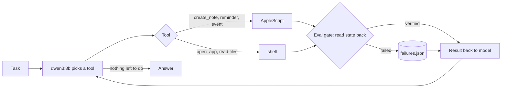

# mac-agent

A local Mac assistant. You type a task, a small model running on your own
machine figures out which tools to call, and the tools do the work through
macOS itself. **No cloud APIs, no subscriptions, zero data leaving your Mac.**

```bash
python mac_agent.py "make a note called Ideas with a haiku about the sea"
python mac_agent.py "add a reminder to buy coffee and open Calendar"
```


```mermaid
graph LR
    A[Task] --> B[qwen3:8b picks a tool]
    B --> C{Tool}
    C -->|create_note, reminder, event| D[AppleScript]
    C -->|open_app, read files| E[shell]
    D --> V{Eval gate: read state back}
    E --> V
    V -->|verified| F[Result back to model]
    V -->|failed| L[(failures.json)]
    L --> F
    F --> B
    B -->|nothing left to do| G[Answer]
```

The model never touches the mouse. It only decides *what* to do; the OS handles
*where*. That one choice is why an 8B model running locally is reliable here —
see the note at the bottom.

## Two agents in here

- **`mac_agent.py`** — the real thing. Tool-calling over AppleScript + shell.
  Reliable, fast (~8s a step warm), works every time on native apps.
- **`simple_agent.py`** — the pure-vision version, kept as a foil. It takes a
  screenshot and has the model guess pixel coordinates to click, the way
  Claude's computer-use loop works. It's slow and it misses a lot. It's here to
  show *why* the tool-calling approach exists.

## Quick start

```bash
python3 -m venv .venv
source .venv/bin/activate
pip install -e .
ollama pull qwen3:8b
python scripts/check_setup.py
```

First run of a tool asks for **Automation** permission (System Settings →
Privacy & Security → Automation) — that's macOS gating AppleScript. Allow it
once per app. `simple_agent.py` additionally needs Screen Recording.

## Tools

| Tool | Does | How |
|---|---|---|
| `create_note` | new Apple Note | AppleScript |
| `add_reminder` | new reminder, optional due date | AppleScript |
| `create_event` | new Calendar event | AppleScript |
| `open_app` | launch/focus an app | `open -a` |
| `list_dir` / `read_file` | look around the filesystem | shell |

Adding a tool is a Python function plus a schema entry — no framework.

## Closed-loop reliability

A tool call that *returns* is not a tool call that *worked*. Notes will happily
make a blank note; Calendar will accept an event on a calendar that doesn't
exist. So the agent doesn't trust return strings — it runs a **closed loop**:
act, then read the world back and confirm.

- **Eval gates.** Each state-changing tool has a `verify()` that queries the OS
  for ground truth — does a note with that title actually exist now? A gate
  that fails is rewritten into an `error:` and handed back to the model, which
  has to react instead of declaring victory. Verification lives in the system,
  not in the model's self-assessment, for the same reason the coordinates do.
- **Failure-pattern memory.** Every error and every failed gate is persisted to
  `failures.json` as a typed `(tool, args, error)` signature. On the next run,
  the recent signatures are folded back into the system prompt as negative
  examples — so a mistake made once ("calendar 'Home' doesn't exist") becomes a
  constraint the agent carries forward. The loop gets more reliable the more it
  runs, without retraining and without leaving your Mac.

Same principle as everything else here: keep the small model out of the parts
it's weak at. It doesn't have to *judge* whether it succeeded, and it doesn't
have to *remember* what went wrong — the system does both and feeds it back.

## The 7B dilemma (what went wrong, and why it ended up like this)

The first plan was the obvious one: screenshot the screen, let the model see it,
have it point the mouse and click — a fully general "AI uses my computer" agent.
It technically ran. It was also slow (~55 seconds a step) and got things wrong
constantly: it would invent a button that wasn't there, misjudge a coordinate by
a hundred pixels, or read the text on screen and start typing it back like an
instruction.

The reason isn't a bug, it's the model size. A 7–8B model that fits on a laptop
is genuinely weak at the two hardest parts of freestyling a UI: planning a
multi-step task, and pointing at an exact pixel from an image. Cloud agents get
away with it because there's a far bigger model behind them.

So the fix was to stop asking the model to do the parts it's bad at. With
AppleScript, the coordinates come from the OS, not from a guess — the model just
picks `create_note` and fills in the title. Same model, night-and-day
reliability, because the hard part moved out of the model and into the system.

The tradeoff is honest: this only works where a clean interface exists —
scriptable Mac apps, the shell, filtered browser DOM. Point it at a random
bloated website and it hits the same wall the vision version did. That wall is
the size of the model, and locally it doesn't move. So the reliable core is
native macOS, and the messy web is where you'd reach for a cloud model instead.
