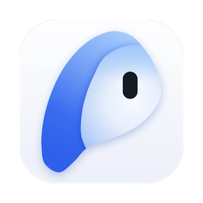
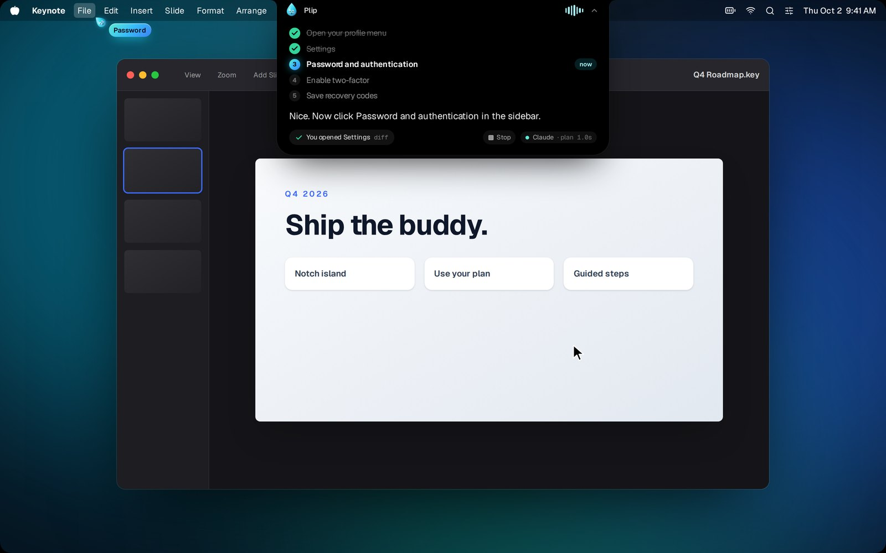
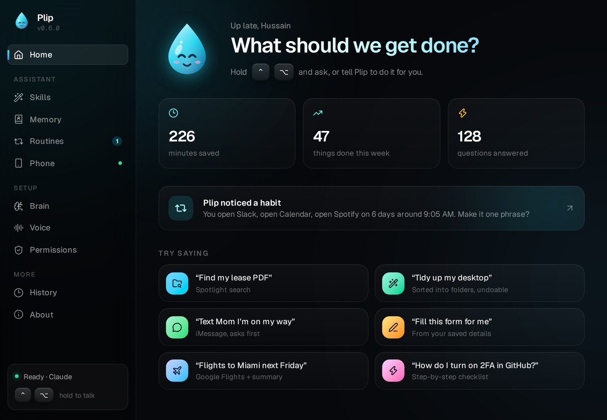
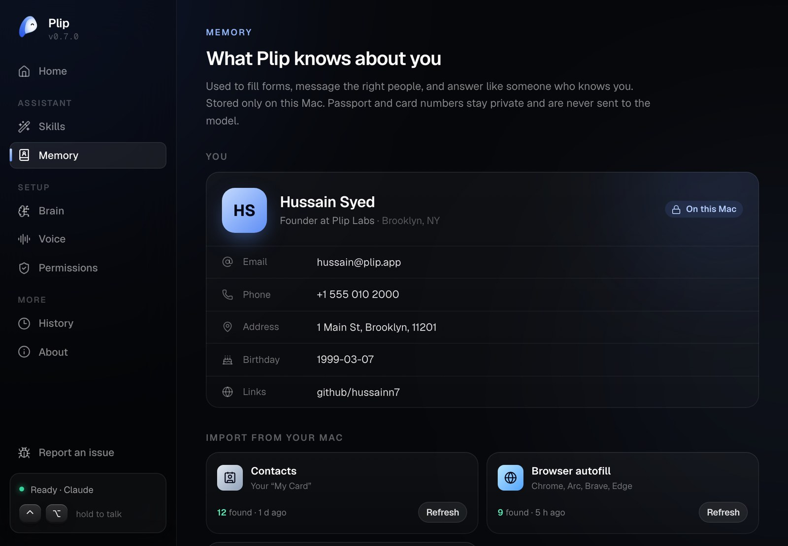

<p align="center"></p>

# Plip

**Personal staff that lives in your MacBook's notch.** Hold **Control+Option** and
talk. Plip looks at your screen, explains things step by step, and does the busywork
for you: finds files, tidies your desktop, pulls up flights, sets reminders,
rewrites your text. It thinks with the **Claude, ChatGPT,
Cursor or Gemini plan you already pay for**.



> "how do I send this deck as a PDF?"
> → a five-step checklist drops out of the notch, and Plip slips out of the notch to
> point at the next click. Plip watches your screen and checks each step off as you go.

> "tidy up my desktop"
> → *"I'll sort your desktop into folders. Here's the plan."* A card shows what goes
> where. Say "yes" or click **Tidy up**, and "undo" puts it all back.

| Ask | Plip |
|---|---|
| "find my lease pdf" | Spotlight search, reads you the hits, opens the one you want |
| "tidy up my desktop" | shows the plan (Screenshots 12, Documents 5…), moves files on your yes, "undo" puts them back |
| "flights to Miami next Friday" | opens Google Flights, waits for results, tells you the best options and points at the cheapest |
| "rewrite this email to sound friendlier" | replaces the selected text in place |
| "remind me to call the dentist at 4" · "set a 10 minute tea timer" | Reminders, Notes and timers that ping you |
| "turn on dark mode" · "volume 30" · "run my Log Water shortcut" | Mac settings and your Apple Shortcuts |
| "remember I prefer aisle seats" | adds it to what Plip knows about you |

Anything that moves your files shows you a preview first, and nothing
happens until you say yes.

## Download

**[⬇ Download Plip for Mac (.dmg)](https://github.com/hussainn7/mcp-vision/releases/latest)**: free and open source. macOS 13+, Apple Silicon.

1. Open the `.dmg` and drag **Plip** into **Applications**.
2. Open Plip from Applications. If macOS says it can't check it for malicious software,
   go to System Settings → Privacy & Security and click **Open Anyway** (only the first time).
3. Sign in with Google once: your account is your name and email, nothing you do with Plip
   ([what it holds](#your-account)).
4. A short welcome walks you through it: allow Screen Recording, Accessibility and
   Microphone, then click **Connect AI**. Done.
5. Hold **Control+Option**, ask something, let go.

Something broken? Click **Report a bug** in Plip's menu bar (or **Settings → General**), or
[open a GitHub issue](https://github.com/hussainn7/mcp-vision/issues).

## Quick start (from source)

```bash
curl -fsSL https://raw.githubusercontent.com/hussainn7/mcp-vision/main/scripts/install.sh | bash
plip                 # Plip moves into your notch; the dashboard opens on first run
```

Pick a brain under **Brain**. If you're already signed in to one of these, Plip finds
it and uses your plan:

| Your plan | One-time sign-in | Sees screenshots |
|---|---|---|
| Claude Pro / Max | `claude auth login` ([Claude Code](https://claude.com/claude-code)) | yes |
| ChatGPT Plus / Pro | `codex login` → *Sign in with ChatGPT* ([Codex CLI](https://github.com/openai/codex)) | yes |
| Cursor | `agent login` ([Cursor CLI](https://cursor.com/cli)) | text only (Plip reads it the screen map) |
| Google account | run `gemini` once → *Login with Google* ([Gemini CLI](https://github.com/google-gemini/gemini-cli)) | yes |
| none of these | paste an `ANTHROPIC_API_KEY` | yes, fastest first word |

Plip runs the CLI once per question in an empty scratch folder with its own tools
switched off, so the model only ever sends back words and Plip's action tags. Plip
does the actions itself, and anything that buys, sends or deletes asks you first.



Then hold **Control+Option**, talk, and let go.

- The island drops out of the notch with a live waveform and your words, then shows
  what Plip is doing (looked at 2 screens, searched files, snapped to "Export").
- Click **⌃** on the island to minimize it back into the notch; hover to peek.
- Press the shortcut again while Plip is talking to interrupt it.
- Menu bar: *Open Plip*, *Brain*, *Show Plip by my cursor*, *Forget this conversation*.

### Optional extras

| Key | Without it | With it |
|---|---|---|
| `TYPESAFE_API_KEY` | rule-based routing, heuristic snapping | [Jev](https://console.typesafe.ai) System-1 routing and element choice in ~100 ms |
| `ELEVENLABS_API_KEY` | macOS `say` | a natural ElevenLabs voice (`eleven_flash_v2_5`) |
| `ASSEMBLYAI_API_KEY` | on-device Apple Speech | AssemblyAI streaming (`u3-rt-pro`) |

Paste them in the dashboard, or see [.env.example](.env.example). `plip doctor` checks
brains, keys and permissions from the terminal.

**Listening on your Mac with Parakeet.** Under **Voice → Listening**, pick Parakeet for
NVIDIA's Parakeet Unified 0.6B instead of Apple's recognizer: it catches more of what you
say, with punctuation, and nothing leaves your Mac. It's a one-time 663 MB download
(pinned, checksummed, resumable); Apple's keeps listening until it's done.

**Activity.** The **Activity** tab's Usage view shows every request from this Mac: per day, when you ask, how
it ended, which brain and plan, and what it would cost at API prices (what your plan is
worth). It stays on your Mac.

**Permissions in one click.** **Allow** opens the exact page in System Settings with a small
card docked under it: drag Plip into the list and it's on.

### Try it from the terminal (any OS)

```bash
plip ask --image screenshot.png "where's the export button?"
plip ask --engine codex --json "find my lease pdf"     # prints what Plip said, did, and pointed at
```

## Memory: Plip knows you

Plip keeps a small knowledge panel about you on your Mac, and uses it to answer like
someone who knows you. Import it in a few
seconds from what's already on your Mac:

- **Contacts**: your "My Card" (name, emails, phones, address, birthday, company, links)
- **Browser autofill**: Chrome, Arc, Brave and Edge profiles
- **Mail**: your accounts and addresses
- **ChatGPT, Claude or Gemini memory**: copy Plip's prompt into your assistant and paste
  its answer back. This is the same pattern as Claude's Import Memory.

Everything lives in `~/.config/mcp-vision/memory.json` (mode 0600). Passport, card and
Social Security numbers are detected, stored privately, and never sent to the model.
From the terminal: `plip memory import contacts`, `plip memory show`, `plip memory prompt`.



## How it thinks

```
⌃⌥ ──▶ mic ──▶ AssemblyAI / Apple Speech ──▶ transcript ──▶ notch island (live)
                                               │
 screenshots (prefetched) ─┐                   ▼
 Accessibility screen map ─┼──▶ Jev router (needs screen? which monitor? walkthrough?)
 what Plip knows about you ┘
                           ▼
   your brain (Claude Code / Codex / Cursor / Gemini / API), streamed
     ├─▶ sentences ──▶ TTS queue (speaks sentence 1 while 2 is synthesized)
     ├─▶ [POINT:x,y:label]       ──▶ snap to the real control ──▶ Plip slips out of the notch to it
     ├─▶ [STEPS:n] [PLAN: a | b] ──▶ checklist in the notch; Plip watches the screen and gives the next step
     └─▶ [DO:name {json}]        ──▶ action engine ──▶ preview + your yes (if it moves files) ──▶ done
                                       └──▶ results (search hits, a loaded page) go back for one more turn
```

- **Screen map.** Plip lists the frontmost app's real controls (label, role, center in
  screenshot pixels), so the model points at things that exist, fills the right fields,
  and text-only brains can still point.
- **Walkthroughs.** For "how do I…" the model announces the steps, and Plip shows them
  as a checklist. A 64×40 screen fingerprint tells Plip when you've done a step, and it
  takes a fresh look before giving the next one.
- **Actions.** The model asks for actions with `[DO:…]` tags. Plip runs them itself on
  your Mac (`open`, Spotlight, AppleScript, Shortcuts, Accessibility), with timeouts,
  an undo history, and a local log.
- **Depth.** Fast, Balanced and Deep map to low, medium and high effort.

Everything above the windows is platform-neutral and tested, including the CLI
engines (through real subprocesses) and a full `plip` CLI run against a fake Claude
Code. The macOS layer is three WKWebViews (island, mascot, dashboard) rendering one
React bundle, plus an event tap and audio glue. See [docs/BUDDY.md](docs/BUDDY.md).

## Development

```bash
python3.12 -m venv .venv && source .venv/bin/activate
pip install -e '.[dev]'
ruff check . && python -m pytest

cd ui && npm install && npm run build      # React 19 + Tailwind 4 + Motion → src/mcp_vision/buddy/web/index.html
npm run dev                                # open #showcase for the fake-desktop demo, #settings, #island
npm run e2e                                # clicks through the island and dashboard in Chromium
```

More in [CONTRIBUTING.md](CONTRIBUTING.md).

## License

MIT

## Updates

Once a day Plip asks GitHub whether a newer release is out (one request to api.github.com, nothing about you in
it). When there is one, the notch says so once, and the menu bar, Home and **Settings → General** offer
**Download**: it opens the new DMG; quit Plip, then drag the new one into Applications. Your settings,
memory and sign-in stay. Turn it off in **Settings → General → Tell me about new versions**.

## Your account

The download asks you to sign in with Google once, before anything else. Sign-in goes through Supabase Auth,
Plip's account server: Google tells it your name, email address and profile picture, and it keeps your account
(name, email, the link to your Google profile picture, when you joined and when you last signed in). That's how
we know who uses Plip.

- On this Mac, `~/.config/mcp-vision/account.json` (readable only by you) keeps your name, email and the sign-in
  session. Plip doesn't download or keep your picture.
- Each time Plip starts, it renews the session with Supabase once. If your account was removed, Plip signs out.
- What you ask Plip, your screen, memory and history are never sent to the account server or tied to your account.
- **Settings → Account → Sign out** forgets the account on this Mac and ends the session. To have the account
  itself deleted, email team@plip.dev from the address you signed in with (the full policy is at
  [plip.dev/privacy](https://plip.dev/privacy)).

Running from source without a sign-in project (the default) never asks you to sign in and never contacts the
account server. The code is [`src/mcp_vision/buddy/account.py`](src/mcp_vision/buddy/account.py).

## Analytics

Plip sends one anonymous ping per day (random install id, version, OS) so we can count active users. No screens, files, or prompts are ever sent. Opt out with `MCP_VISION_NO_ANALYTICS=1` or `DO_NOT_TRACK=1`.
