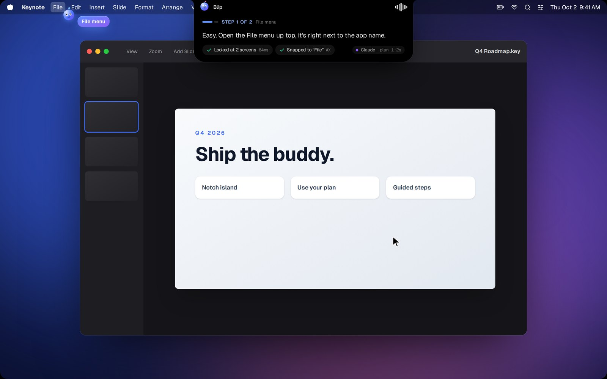
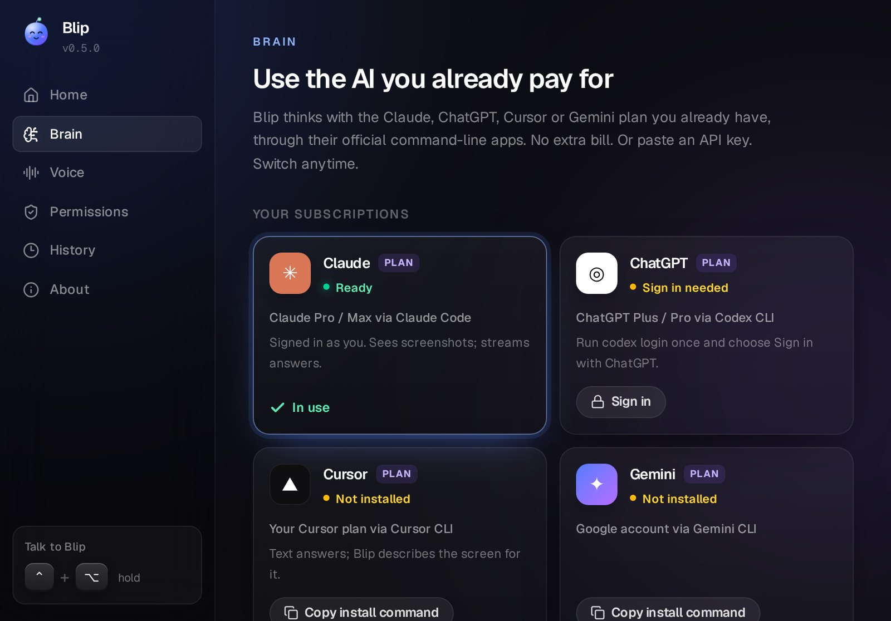

# Blip

**An AI buddy that lives in your MacBook's notch.** Hold **Control+Option** and ask
out loud. Blip looks at your screen, answers in a natural voice, and **flies over
to the exact button, menu, or field** you need. It thinks with the **Claude,
ChatGPT, Cursor or Gemini plan you already pay for**, so there's no extra bill.



> "how do I export this as a PDF?"
> *"Easy. Open the File menu up top."* → Blip arcs over to **File** →
> *(you open it; Blip sees the menu appear)* → *"Now pick Export To, then PDF."*

Blip started as a Python take on [Clicky](https://github.com/farzaa/clicky). It
keeps Clicky's push-to-talk feel, pointing protocol and motion design, and goes
further:

| | Clicky (open source) | Blip |
|---|---|---|
| Lives | a triangle by the cursor | a Dynamic-Island-style **notch island** + Blip, a little mascot by your cursor |
| Brain | Claude, via a server you deploy | **your own plan**: Claude Code (Pro/Max), Codex (ChatGPT Plus/Pro), Cursor CLI, Gemini CLI, or an API key |
| Multi-step help | one answer | **guided walkthroughs**: Blip watches the screen and gives the next step when you've done the last one |
| Sees | screenshots only | screenshots + a **screen map** of real controls (Accessibility), so even text-only brains can point |
| Speech starts | after the whole reply is generated and synthesized | per sentence, while the model is still streaming |
| Pointer lands on | the model's estimate | the real control, snapped via Accessibility (Jev picks the element) |
| Screenshots | always, every screen | Jev decides in ~100 ms: none for general questions, cursor screen only when that's all that matters |

Needs **macOS** and **Python 3.12+**. The headless `blip ask` and the MCP server run anywhere.

## Quick start

```bash
curl -fsSL https://raw.githubusercontent.com/hussainn7/mcp-vision/main/scripts/install.sh | bash
blip                 # Blip moves into your notch; Settings opens on first run
```

Pick a brain in Settings → **Brain**. If you're already signed in to one of these,
Blip finds it and it just works:

| Your plan | One-time sign-in | Sees screenshots |
|---|---|---|
| Claude Pro / Max | `claude auth login` ([Claude Code](https://claude.com/claude-code)) | yes |
| ChatGPT Plus / Pro | `codex login` → *Sign in with ChatGPT* ([Codex CLI](https://github.com/openai/codex)) | yes |
| Cursor | `agent login` ([Cursor CLI](https://cursor.com/cli)) | text only (Blip reads it the screen map) |
| Google account | run `gemini` once → *Login with Google* ([Gemini CLI](https://github.com/google-gemini/gemini-cli)) | yes |
| none of these | paste an `ANTHROPIC_API_KEY` | yes, fastest first word |

Blip runs the CLI once per question in an empty scratch folder with its tools
switched off (no shell, no file edits, no MCP servers), so it only ever gets words
and `[POINT]` tags back.



The first run asks macOS for **Screen Recording**, **Accessibility** (hotkey,
pointer snapping, screen map) and **Microphone**. The Settings → Permissions tab
has a button for each. For permissions that stick across updates, build the signed
app once: `python scripts/build_macos_app.py`, then open `/Applications/MCP-Vision.app`.

Then hold **Control+Option**, talk, and let go.

- The island drops out of the notch: live waveform, your words, what Blip is
  doing (looked at 2 screens, asked Claude, snapped to "Export"), then the answer.
- Press the shortcut again while Blip is talking to interrupt it.
- Hover the notch to peek at the last answer; click the gear for Settings.
- Menu bar: *Open Blip*, *Brain*, *Show Blip by my cursor*, *Forget this conversation*.

### Optional extras

| Key | Without it | With it |
|---|---|---|
| `TYPESAFE_API_KEY` | rule-based routing, heuristic snapping | [Jev](https://console.typesafe.ai) System-1 routing and element choice in ~100 ms |
| `ELEVENLABS_API_KEY` | macOS `say` | Clicky's ElevenLabs voice (`eleven_flash_v2_5`) |
| `ASSEMBLYAI_API_KEY` | on-device Apple Speech | AssemblyAI streaming (`u3-rt-pro`), as in Clicky |

Paste them in Settings, or see [.env.example](.env.example) for every knob.
`blip doctor` checks engines, keys and permissions from the terminal.

### Try it without a Mac

```bash
blip ask --image screenshot.png "where's the export button?"
blip ask --engine codex --json "what's on my screen?"     # captures the real screen if there is one
```

This prints what Blip would say, where it would point (global screen points), the
route Jev or the rules chose, and the latency of each stage.

## How it thinks

```
Control+Option ──▶ mic ──▶ AssemblyAI / Apple Speech ──▶ transcript ──▶ notch island (live)
                                                             │
   release: screenshots prefetched ──┐                       ▼
   Accessibility screen map ─────────┼──▶ Jev router (needs screen? which monitor? walkthrough?)
                                     ▼
     your brain (Claude Code / Codex / Cursor / Gemini / API), streamed
          │
          ├──▶ sentence splitter ──▶ TTS queue (speaks sentence 1 while 2 is synthesized)
          ├──▶ [POINT:x,y:label:screenN] ──▶ px → points ──▶ snap to the AX element ──▶ Blip flies there
          └──▶ [STEPS:n] … [DONE] ──▶ walkthrough: watch the screen, continue when it changes
```

- **Screen map.** Blip lists the frontmost app's real controls (label, role and
  center in screenshot pixels), so the model points at things that exist and
  text-only brains can still point.
- **Walkthroughs.** For "how do I…" questions the model announces `[STEPS:n]` and
  gives one step. Blip watches the screen (a 64×40 fingerprint diff every 0.7 s)
  and, once you've acted and it settles, takes a fresh look and gives the next step,
  until `[DONE]`.
- **Depth.** Fast / Balanced / Deep in Settings maps to low / medium / high effort;
  walkthroughs go one step higher for that turn.

Everything above the windows is platform-neutral and unit-tested, including the CLI
engines, which the tests drive through real subprocesses. The macOS layer is three
WKWebViews (island, Blip, Settings) rendering one React bundle, an event tap and audio
glue. See [docs/BUDDY.md](docs/BUDDY.md).

## MCP server (for Cursor, Claude Desktop, Claude Code)

The original browser/desktop runtime still ships, and it is independent of the buddy:

```bash
mcp-vision setup --host cursor               # or claude-desktop, antigravity
claude mcp add --transport stdio mcp-vision -- mcp-vision serve --browser live --driver native --allow-browser-writes
```

- `serve --browser live` drives the Chrome you already have open, with no
  automation banner.
- With `TYPESAFE_API_KEY` set, routine actions are picked by Jev's bounded
  fast policy. Consequential actions always escalate.
- Buy, send and book actions still need *Allow once*.

More: [docs/RUNTIME.md](docs/RUNTIME.md), [docs/STATE_RUNTIME.md](docs/STATE_RUNTIME.md),
[docs/BENCHMARKS.md](docs/BENCHMARKS.md).

The previous Option-Space popup (Ask / Guide / Act with form filling) is still
available as `mcp-vision ui`, or as an app with `scripts/build_macos_app.py --entry ui`.

## Development

```bash
python3.12 -m venv .venv && source .venv/bin/activate
pip install -e '.[dev]'
PYTHONPATH=src:. python -m pytest

cd ui && npm install && npm run build      # React 19 + Tailwind 4 + Motion → src/mcp_vision/buddy/web/index.html
npm run dev                                # open #showcase for the fake-desktop demo, #settings, #island
```

The CI sequence, including real Chromium contracts, is in
[CONTRIBUTING.md](CONTRIBUTING.md).

## License

MIT
